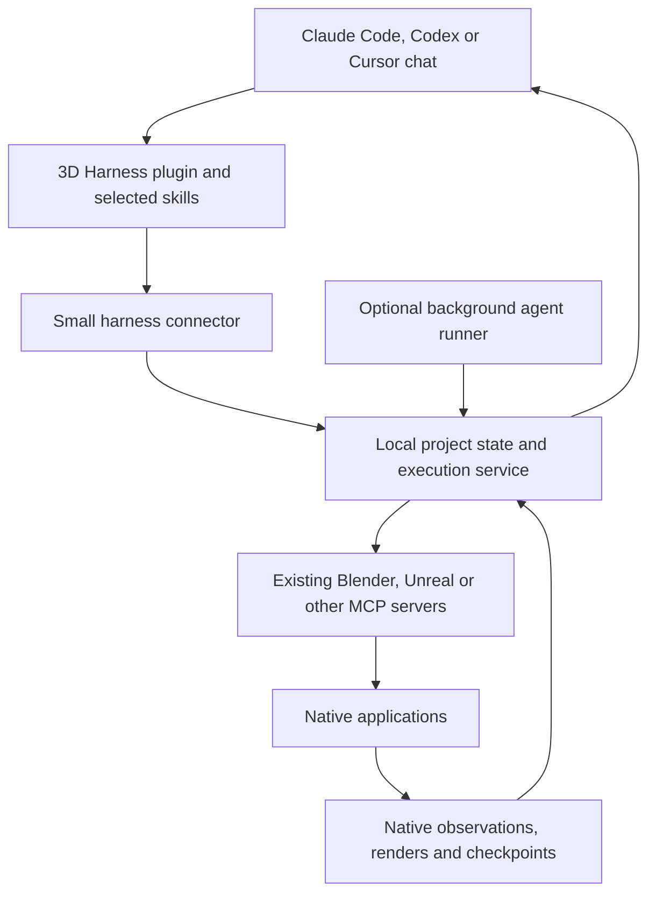

# DCC Harness Packaging and Entry Points

Supporting target design. Implement after the creative-value gate in the [active build plan](./DCC_HARNESS_BUILD_PLAN.md). The first experiment uses local skills and scripts in the current client; three installers, a daemon and a background runner are not prerequisites. [Decision D8](./DESIGN_DECISIONS.md#d8-package-the-proven-workflow) governs sequencing.

Proposed design, October 3, 2026. Package 3D Harness as a plugin for the artist's existing agent environment, backed by a shared local runtime. Claude Code, Codex and Cursor remain the normal place to give instructions and review results. Existing DCC MCP servers remain responsible for application operations.

This document defines packaging and activation, not an implemented installer. Commands and interfaces below are proposed. No plugins, services or client configuration were installed or changed during this review.

## Recommended product shape

The plugin is the entry point. The local runtime holds the production project independently of any one conversation. A small connector exposes that runtime to each client. Most creative decisions initially come from the agent already running in the user's chat.



The connector can use MCP because all three clients already understand it. Its purpose is project coordination and accountable execution, not another library of Blender or Unreal commands. Expose the same functions through a CLI for troubleshooting and clients that cannot load the connector.

Keep the service executable independently of the connector. Closing a client-owned stdio connection must not erase project state or accidentally terminate an explicitly detached job. On Windows, use a background supervisor without opening extra console windows. Start it on demand; add startup-at-login only as an explicit product setting.

## What each layer owns

| Layer | Responsibilities |
|---|---|
| Client plugin | Discover the harness, activate workflows, load relevant skills, present status and evidence |
| Host agent | Interpret the brief, plan, select methods, inspect results and propose revisions |
| Local harness runtime | Project records, dependencies, leases, receipts, checkpoints, validation, budgets and recovery |
| Existing DCC MCP | Native queries, edits, renders and application-specific capabilities |
| Optional background agent | Supply new planning and critique decisions when the interactive host is absent |

A host conversation is a planning session, not the authoritative project database. Resume from the current specification, native checkpoint, accepted decisions and outstanding defects. A different client can continue the project without translating the original chat transcript.

This changes the earlier default choice of a custom reasoning loop: LangGraph is optional for a future backend that needs it. It is not a prerequisite for using the plugin with Claude Code, Codex or Cursor.

## Supported packaging surfaces

The following are documented capabilities, checked on October 3, 2026. Each release still needs installation tests against selected client versions.

| Client | Documented packaging | Proposed integration |
|---|---|---|
| Codex | Portable root `plugin.json`, skills and `mcp.json`; `.codex-plugin/plugin.json` remains a compatibility format. Local/repository marketplaces support development distribution. | Small plugin with entry skills and a local connector. Generate an OpenAI-specific overlay only where required. [Package guide](https://developers.openai.com/plugins/build/plugins) |
| Claude Code | `.claude-plugin/plugin.json`, skills, hooks and MCP configuration. Skills can also be invoked as namespaced commands. | Native Claude package generated from shared skills; connector and a few workflow commands. [Plugin overview](https://code.claude.com/docs/en/plugins) |
| Cursor | Portable Agent Plugins support skills/MCP; `.cursor-plugin/plugin.json` supports additional Cursor components. | Portable baseline, with a Cursor package when commands or hooks are needed. [Plugin reference](https://cursor.com/docs/reference/plugins) |

Use one source library and generated release packages. Do not maintain three separate creative instruction sets. Host-specific settings, invocation syntax, hooks and paths belong in small integration templates. Cursor currently documents different path-variable expansion from the portable standard; test relocatable installs rather than assuming manifest compatibility guarantees identical runtime behavior. [Cursor path handling](https://cursor.com/docs/reference/plugins)

A suggested source layout is:

```text
packages/
  runtime/                  # project service, CLI and MCP client connections
  connector/                # small control interface for agent clients
  plugin-shared/skills/     # reusable entry and creative skills
integrations/
  codex/
  claude-code/
  cursor/
adapters/
  blender/
  unreal/
tests/installation/
```

Build self-contained packages with their referenced resources inside the package. Keep runtime data outside plugin caches so upgrades or uninstalling a client package cannot delete the production project. Pin runtime, connector, skill and adapter versions together in a compatibility manifest.

## Installation and everyday activation

The intended first-use experience is:

1. Install the 3D Harness plugin in the chosen client.
2. Say, “Set up 3D Harness for this project.” A setup skill finds or installs the pinned local runtime through the supported installer and checks the intended DCC connection.
3. Confirm the project and application instance only if discovery is ambiguous. Reuse existing MCP configuration where possible, without overwriting unrelated entries.
4. Give the creative brief in the normal chat. The harness records the brief and starts the qualified workflow.

Package the runtime so ordinary users do not have to assemble Python environments. Start Windows-first with a versioned runtime bundle and a small launcher; retain a Python developer installation path. Marketplace installation alone must not be described as installing Blender, compiling an Unreal bridge or provisioning every prerequisite. Setup should report missing dependencies with the exact next action.

Run a connection diagnostic that distinguishes installed configuration, tools visible in this session, a responding bridge, and a verified native operation. Use a disposable project for the write/save/reopen probe. Report when the client needs a fresh session to discover new tools.

Keep daily entry points small:

| User intent | Example request | Harness behavior |
|---|---|---|
| Start | “Use 3D Harness to build the courtyard environment.” | Create/open the project, resolve the brief, select skills and run bounded tasks |
| Resume | “Continue this environment from its last verified checkpoint.” | Reconcile live state and retrieve a compact continuation packet |
| Review | “Show what changed and what still needs work.” | Present accepted/candidate views, evidence and unresolved defects |
| Revise | “Keep the layout; make the shared stone warmer.” | Version the material, identify consumers and recheck affected views |
| Pause | “Pause after the current safe step.” | Stop new writes, settle the in-flight operation and checkpoint |

Explicit skill or command activation should be dependable; natural-language activation is a convenience. Installing the plugin should not turn every unrelated coding conversation into a DCC job. Skill activation must be tested on positive, ambiguous and unrelated prompts. [OpenAI skill testing guidance](https://developers.openai.com/plugins/build/skills)

## How the harness sits above existing MCP servers

There are two useful integration levels:

| Mode | Operation path | Guarantee |
|---|---|---|
| Advisory prototype | Host calls its existing DCC tools directly; skills maintain plans and request evidence | Low setup overhead, but incomplete control over write ordering, receipts and bypasses |
| Managed project, recommended | Host submits operations through the harness; the harness calls existing DCC MCP servers | The runtime can enforce its execution contract for operations it controls |

Managed mode should become the default before unattended generation. The harness acts as an MCP client downstream and a small project tool server upstream. It can discover native schemas and forward qualified actions without reimplementing their native handlers.

A service cannot automatically borrow another client's private stdio connection. It needs its own correctly configured connection or a supported shared endpoint. Avoid launching duplicate server processes against the same editor without confirming the server's session model. Connection ownership belongs in the adapter contract.

For a managed project, route agent writes through one executor. Prevent or disable parallel direct-write routes in the supported client configuration, while keeping artist edits available through the documented ownership handoff. When that boundary cannot be enforced, label the integration advisory; do not advertise strong write-order guarantees. Hooks can help but cannot replace execution-side enforcement.

Suggested connector functions, not final API names:

- `project.open`, `project.context` and `project.status`
- `run.start`, `run.pause` and `run.resume`
- `capability.search`, `capability.describe` and `operation.execute`
- `review.read` and `review.submit`

Managed writes use the runtime-issued prepare/execute protocol in [decision D4](./DESIGN_DECISIONS.md#d4-operation-identity-and-retry-ownership). Long operations return a handle promptly; later reads collect status and evidence. Domain tools can be discovered on demand, keeping the initial connector surface small.

## Long runs with and without the chat

**Interactive mode is the first implementation.** The existing host agent supplies decisions and the local runtime executes qualified operations. It can persist state across context resets and complete already admitted native work. When the agent is unavailable and a new decision is needed, the run waits for an agent. That is resumability, not unattended creative autonomy.

**Background mode adds an agent backend.** The same plugin can submit a job to a local runner that uses a supported SDK or CLI. The artist still starts and reviews work in their usual client. Choose one backend first, then add others behind the same task interface.

| Candidate runner | Evidence and boundary |
|---|---|
| Codex SDK | Supports programmatic local sessions; the documented Python SDK uses app-server. Qualify tool restrictions, events and cancellation for this workload. [Codex SDK](https://learn.chatgpt.com/docs/codex-sdk) |
| Claude Agent SDK | Provides the Claude Code agent loop, sessions and MCP integration in a process we operate. Validate authentication and distribution requirements separately from an interactive plugin. [Agent SDK](https://code.claude.com/docs/en/agent-sdk/overview) |
| Cursor CLI | Documents non-interactive operation. Treat it as a candidate runner and verify its event, permission and resume behavior before claiming parity. [Headless CLI](https://cursor.com/docs/cli/headless) |

Use supported authentication for each runner. Do not assume that a client subscription automatically funds a separate product backend. The initial interactive plugin can use the agent the user already has; detached execution needs its own explicitly configured backend and usage limits.

At handoff, record the run budget, accepted specification and controller lease. Release the interactive controller only after the background runner acknowledges ownership. Reopening the chat attaches a viewer until ownership is deliberately transferred. Never let both controllers independently replay the same task. Switching providers resumes project state, not hidden model reasoning.

A job may continue while the client is closed only while its required machine, application and runner remain available. After sleep or restart, reconcile native outcomes before continuing. On expiry, rate limiting or missing authorization, checkpoint and report the actual state.

## Hooks and review interface

Use hooks to restore a compact project summary after session start/compaction, annotate relevant tool results and surface incomplete work. They are conveniences and extra checks. Codex documents exceptions to hook coverage and trust requirements; Cursor documents failure behavior that depends on hook configuration. Correctness must survive missing hooks. [Codex hooks](https://learn.chatgpt.com/docs/hooks), [Cursor hooks](https://cursor.com/docs/hooks)

Return ordinary text, images and artifact links first. The native DCC remains the scene editor. Add an optional local review page for contact sheets, version comparisons and timelines when chat becomes awkward. A custom Cursor extension or a replacement chat interface is unnecessary for the first release. OpenAI's app-server is an available deeper integration if a later product needs to own conversations and approvals. [App-server](https://learn.chatgpt.com/docs/app-server)

## Implementation order and acceptance

1. **Current client first:** complete the creative comparison using local skills and the existing MCP. If it justifies a runtime, add the CLI, connector and one entry skill in the current development environment. Start, pause and resume a two-task Blender job from ordinary chat.
2. **Prove separation:** close the client during a render; recover its result in a fresh session. Replace the agent context and resume using only project state. Exercise missing hooks and a disconnected connector.
3. **Add Claude Code and Cursor packages:** generate manifests from shared sources. Run the same installation and project-resume fixtures in each client. Test Windows paths with spaces, upgrades, removal and duplicate activation.
4. **Add one background runner:** qualify controller handoff, reconnect, budget exhaustion, cancellation and application crash before calling the system unattended.
5. **Broaden distribution:** publish marketplace packages only after a clean-machine installation works. Add the review page and optional discipline packs as the production benchmark needs them.

Keep this distinct from DCC breadth: three client frontends can share one proven Blender backend. Estimate these additions after the creative gate and one useful local workflow; no packaging schedule supersedes the active build plan.

Success means an artist can install the package, name a project and start from their normal chat; later they can reopen that project in another supported client and see the same accepted assets, outstanding work and evidence. There should be no requirement to manage transcript files or manually reconstruct a long-running job.
