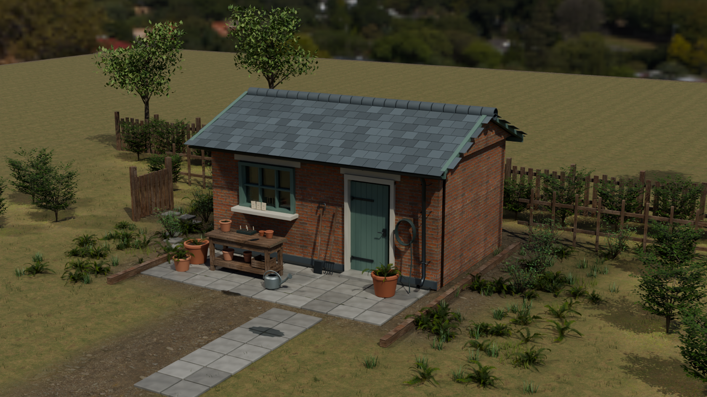

# 3D Harness

**Persistent workflows, practical skills, and measured feedback for longer Blender projects.**

3D Harness helps an agent build and revise a 3D environment while preserving its assets, materials, lighting, and project decisions across sessions. It runs above an existing Blender MCP or owned background Blender process, with the artist working through their usual agent chat.

**Status: v0.4.9 · Blender-first research prototype · one cooperating native writer.**



*A guided production study from the retained checkpoint history. The distant environment and inherited foliage remain unfinished. This image demonstrates a working scene, not a proven advantage over plain MCP. [Image provenance and asset credits](docs/images/README.md).*

## What it does

- **Continues from files:** retains the brief, decisions, checkpoint history, handoff notes, and unresolved operations so a fresh context can resume the project.
- **Starts from existing scenes:** previews missing identity assignments, applies the chosen plan to a new native file, and independently checks its saved identities and observation.
- **Scopes revisions:** records the intended script and preservation contract before an edit, then checks the saved result against that contract.
- **Measures native state:** observes identities, shared assets, evaluated geometry, authored/evaluated UV data, materials, image dependencies, cameras, lights, and selected render settings, with explicit coverage limits.
- **Separates technical and visual acceptance:** a candidate can pass its native checks and still be retained as a visual rejection without replacing the accepted checkpoint.
- **Supplies practical methods:** project skills cover planning, building, review, architecture, materials, environment assembly, and lighting. Python helpers support bounded construction, planting, ground, roof, terrain, and visibility tasks.
- **Supports evaluation:** frozen trial packets, fresh-context revisions, anonymous galleries, and retained failures support controlled comparisons.

The host agent provides reasoning and tool calls. The harness supplies project state and evidence; it does not start an autonomous agent or replace the existing MCP server.

## Getting started

### Requirements

- Python **3.11 or newer**. The core runtime has no third-party Python dependencies.
- Blender for native observation and authoring. Native qualification currently covers **Blender 5.1.1 on Windows**.
- An agent client with workspace access and either an existing Blender MCP connection or access to an owned background Blender process.

Clone the repository and inspect the CLI:

```sh
git clone https://github.com/cedarconnor/3D_Harness.git
cd 3D_Harness
python -m dcc_harness --help
```

Commands work directly from the checkout. For an optional editable installation on Windows:

```powershell
python -m venv .venv
.venv\Scripts\python -m pip install -e .
.venv\Scripts\python -m dcc_harness --help
```

### Activate the workflow in your agent

Open the repository in your normal Codex, Claude Code, or Cursor workspace. Where project skill discovery is available, use the `dcc-harness` entry skill. A portable explicit prompt is:

> Read `.agents/skills/dcc-harness/SKILL.md` and use its workflow to start or resume my Blender project. Preserve the accepted scene, inspect pending operations before editing, and load the craft skills relevant to the task.

The executable skills live in [`.agents/skills/`](.agents/skills/). Keep the repository available: the skills refer to its runtime and documentation. A Python wheel contains the runtime only; it does not install skills, register an MCP, or configure the client. Marketplace plugins and standalone client installers are future work.

## Everyday workflow

```text
Read brief and decisions → inspect the accepted checkpoint → reserve a scoped edit
          ↓
Execute the retained script once → save a new native file → observe and review
          ↓
Publish the checked result, or retain the rejection → write the next handoff
```

For a new project, first save an owned `.blend` and create a clean saved-state observation inside Blender with `dcc_harness.continuity_blender.observe()`. If the scene lacks stable harness identities, use [initial scene adoption](docs/SCENE_ADOPTION.md): `adopt-preview` lists proposed assignments, then `adopt-apply` writes and independently observes a new file. Existing IDs are preserved; ambiguous identities block adoption. See the [everyday workflow](docs/EVERYDAY_WORKFLOW.md) for preparation and exact edit commands.

Example commands below assume you have prepared your own baseline, observation, brief, decisions, and handoff files. They are not bundled demo files.

```sh
python -m dcc_harness start ./my-project/state --checkpoint ./my-project/baseline.blend --observation ./my-project/baseline.json --brief-file ./my-project/BRIEF.md --decisions ./my-project/decisions.json --handoff ./my-project/CONTINUE.md
python -m dcc_harness resume ./my-project/state
python -m dcc_harness review ./my-project/state
```

| Command | Purpose |
|---|---|
| `adopt-preview` / `adopt-apply` | Preview initial identity assignments, then save and independently observe a new Blender file |
| `start` | Establish a continuity project from a saved native file and matching observation |
| `resume` | Verify the checkpoint chain and retrieve decisions, handoff, shared users, and pending work |
| `review` | Retrieve the current project and latest check for inspection |
| `begin-edit` | Retain a script/contract and reserve one scoped edit; execution is separate |
| `finish-edit` | Recompute checks and publish, reconcile, or retain a rejected result |
| `check` / `diff` | Evaluate observed requirements or declared changes |
| `pack-observation` | Write a new lossless compact observation without rewriting retained evidence |

If acknowledgement is lost, inspect the saved native result and reconcile it before sending another write. Direct MCP edits remain outside the reservation mechanism. Use one native writer and preserve the accepted file.

## Skills

| Skill | Use |
|---|---|
| [`dcc-harness`](.agents/skills/dcc-harness/SKILL.md) | Start, resume, review, and route ordinary work |
| [`dcc-plan-environment`](.agents/skills/dcc-plan-environment/SKILL.md) | Define the brief, shared assets, constraints, and review views |
| [`dcc-build-revise`](.agents/skills/dcc-build-revise/SKILL.md) | Author scoped changes and save measured checkpoints |
| [`dcc-review-continue`](.agents/skills/dcc-review-continue/SKILL.md) | Inspect results, preserve accepted work, and prepare a handoff |
| [`dcc-architecture`](.agents/skills/dcc-architecture/SKILL.md) | Openings, dimensions, construction joins, and roof details |
| [`dcc-materials`](.agents/skills/dcc-materials/SKILL.md) | Shared material users, physical texture scale, glass, and wear |
| [`dcc-environment-assembly`](.agents/skills/dcc-environment-assembly/SKILL.md) | Ground support, planting, circulation, boundaries, and purposeful detail |
| [`dcc-lighting-review`](.agents/skills/dcc-lighting-review/SKILL.md) | Lighting intent, camera framing, and controlled comparisons |
| [`dcc-blind-test`](.agents/skills/dcc-blind-test/SKILL.md) | Coordinate explicitly requested independent comparisons |

Read [craft capabilities and recipe boundaries](docs/CRAFT_SKILLS.md) before treating a skill as a general-purpose geometry or artistic-quality validator.

## Validation and current limits

The v0.4.9 source suite ran **186 tests: 184 passed, two Windows symlink-permission cases skipped**. Native checks separately exercise identity adoption, shared-data edits, saved-file continuation, unresolved-write detection, and reconciliation without redispatch. See [adoption qualification](docs/ADOPTION_0_4_9_RESULTS.md) for native and installed-package evidence. The production study retains nine accepted checkpoints and three subsequently rejected background candidates.

On one saved 1,289-object environment, median native observation time improved from **41.52 to 22.53 seconds** across three alternating pairs. Eight native fixture states matched the previous observer exactly except timestamps. The larger scene showed evaluated UV variability that also reproduced with the old observer and passed the existing preservation policy unchanged; bitwise identity is not claimed. [Full v0.4.8 results](docs/OBSERVER_0_4_8_RESULTS.md).

The earlier short comparison used six independent builds and six fresh revisions; both artist-preferred entries used plain MCP. The longer comparison completed sixteen fresh sessions with fourteen native-check passes and two incomplete stages. These studies have **not established a general visual-quality or long-horizon advantage** for the harness. [Short comparison](docs/BLIND_RESULTS.md) · [Longer comparison](docs/CONTINUITY_RESULTS.md).

Current boundaries:

- Advisory execution: no native sandbox, exactly-once guarantee, external-write interception, or unattended agent scheduler.
- Blender qualification only; Unreal and other DCC adapters remain planned.
- Observation coverage is explicit and incomplete: animation over time, arbitrary procedural instances, rig semantics, general topology quality, and UV overlap are not certified.
- Hashes bind evidence to files; they do not authenticate producer truthfulness or establish artistic quality.
- Animation, motion graphics, broader design-taste skills, and client installers remain future work.

## Development and tests

Run the portable suite from the repository:

```sh
python -m unittest discover -s tests -v
```

Native scripts must run inside Blender. For example, this visibility fixture uses a new output directory and a separate background process:

```powershell
& 'C:/Program Files/Blender Foundation/Blender 5.1/blender.exe' --background --factory-startup --python-exit-code 1 --python scripts/qualify_visibility.py -- --repo . --out runs/my-visibility-check
```

Choose a fresh output path. Inspect the process exit code and report; a success message alone is insufficient. See [validation](docs/VALIDATION.md) and [observer performance qualification](docs/OBSERVATION_PERFORMANCE.md) for the scope of each test.

## Repository guide

| Path | Contents |
|---|---|
| `dcc_harness/` | CLI, continuity store, observations, checks, review utilities, and bounded recipes |
| `.agents/skills/` | Current project skills |
| `scripts/` | Native fixtures, evaluators, asset intake, and experiment tooling |
| `tests/` | Portable regression suite |
| `examples/` | Procedural courtyard example and spec |
| `experiments/` | Retained briefs, contracts, and comparison methods |
| `docs/` | Usage, capabilities, qualification results, and limitations |
| `dcc-skills/`, `research/` | Historical design inputs; example APIs may be unimplemented or superseded |
| `runs/` | Local native files, observations, rendered galleries, and test logs; excluded from Git |

Downloaded asset kits, private photographic references, large `.blend` checkpoints, and local run galleries are not included in a clone. Some detailed reports link to those local artifacts; the written reports and representative README render are included. The example render's source assets are credited [here](docs/images/README.md).

## Further reading

- [Everyday workflow](docs/EVERYDAY_WORKFLOW.md) and [continuity APIs](docs/CONTINUITY_USAGE.md)
- [Reference-led quality loop](docs/QUALITY_LOOP_USAGE.md)
- [Craft skills](docs/CRAFT_SKILLS.md) and [terrain study](docs/TERRAIN_0_4_7_RESULTS.md)
- [Active build plan](DCC_HARNESS_BUILD_PLAN.md) and [design decisions](DESIGN_DECISIONS.md)
- [Packaging and entry points](DCC_HARNESS_PACKAGING_AND_ENTRY_POINTS.md)
- [Skill and motion-design plans](DCC_HARNESS_SKILL_SYSTEM.md)
- [Research](DCC_HARNESS_RESEARCH.md) and [UE-MCP review](DCC_HARNESS_UE_MCP_REVIEW.md)

The active build plan and decision log take precedence over the original architecture note and historical proposals. Broader capabilities described in those studies are proposals, not shipped features.
